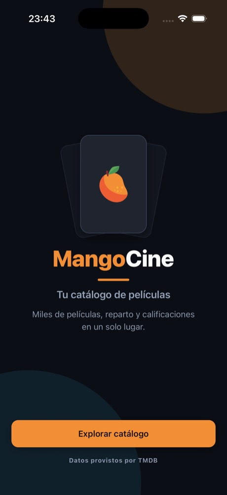
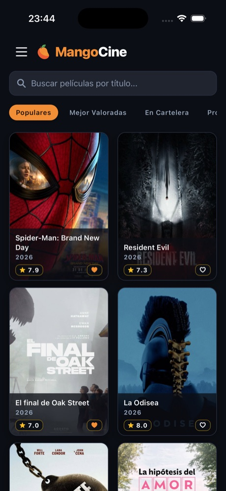
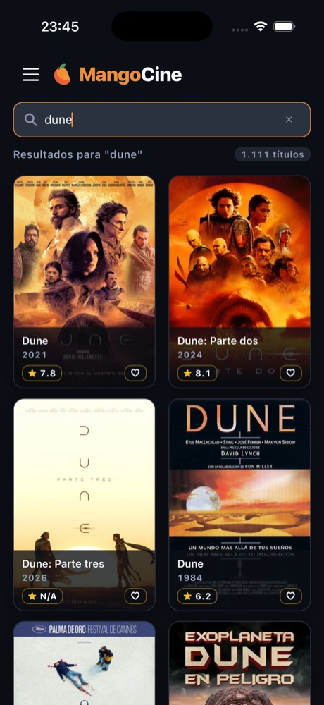
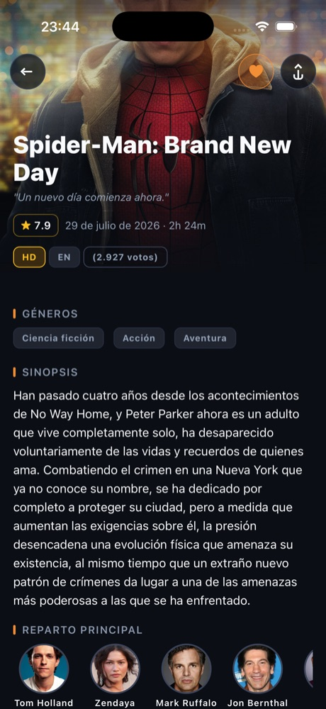
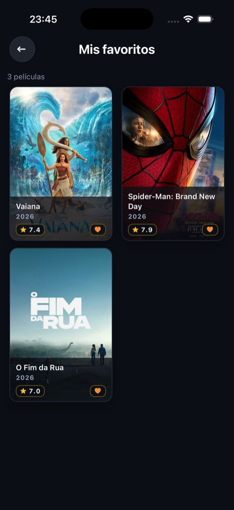
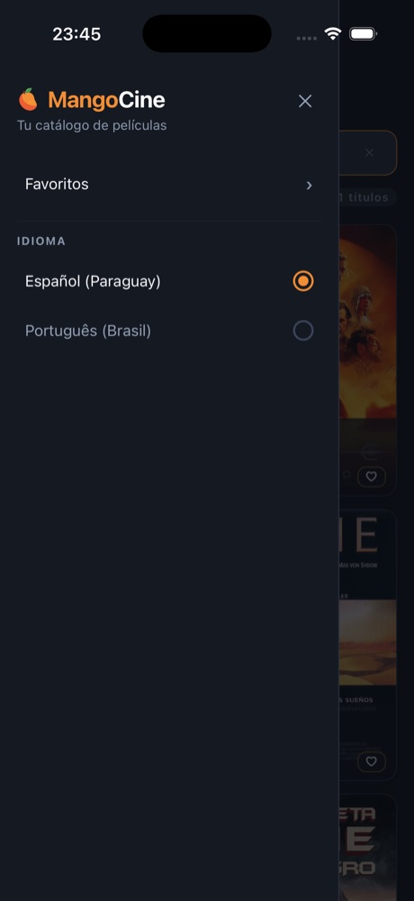

# MangoCine

> Catálogo de filmes (TMDB) em **React Native CLI + TypeScript**, com arquitetura
> modular, i18n (es-PY / pt-BR), testes abrangentes e foco em performance de
> listas longas.


---

## TL;DR

```bash
npm install
npm run ios     # ou: npm run android
```

Funciona **sem configuração**: o app já vem com uma API key pública read-only do
TMDB. Para usar a sua, basta trocar o valor em `src/app/config/env.ts`.

---

## Screenshots

|                          Landing                          |                         Catálogo                          |                          Busca                           |
| :-------------------------------------------------------: | :-------------------------------------------------------: | :------------------------------------------------------: |
|  |  |  |

|                         Detalhe                          |                          Favoritos                          |                     Menu / idioma                      |
| :------------------------------------------------------: | :---------------------------------------------------------: | :----------------------------------------------------: |
|  |  |  |

---

## Funcionalidades

- **Catálogo** com 4 categorias (Populares, Melhor Avaliadas, Em Cartaz, Em Breve).
- **Scroll infinito** com deduplicação + pull-to-refresh.
- **Busca em tempo real** com debounce (400ms).
- **Detalhe** com backdrop/pôster em alta resolução, gêneros, elenco e sinopse.
- **Favoritos** normalizados (`{ byId, allIds }`, O(1)) + tela dedicada, persistidos localmente.
- **i18n** pt-BR / es-PY com troca em runtime.
- **Landing de branding** + botão para o catálogo.
- **Menu hamburger** no cabeçalho com seletor de idioma.
- **Skeletons** pulsantes (60fps, native driver) em listas e imagens.
- **Compartilhar** via share sheet nativo (iOS/Android).

---

## Stack

| Camada          | Escolha                                                               |
| :-------------- | :-------------------------------------------------------------------- |
| App             | React Native CLI 0.87 + New Architecture + Hermes                     |
| Linguagem       | TypeScript estrito (sem `any`)                                        |
| Estado/dados    | Redux Toolkit + RTK Query (cache, dedupe, prefetch)                   |
| Navegação       | React Navigation (Native Stack, tipado)                               |
| Layout          | `react-native-safe-area-context` (notch/status bar)                   |
| Imagens         | `@d11/react-native-fast-image` (cache memória/disco + priority)       |
| Testes          | Jest + Testing Library (unitário e integração) + Maestro (E2E)        |
| Observabilidade | Logger estruturado + `ErrorBoundary` global + monitor de FPS dev-only |

---

## Arquitetura

Feature-driven com núcleo compartilhado:

```text
src/
├── app/          # bootstrap, store, providers, config
├── features/     # vertical slices: movies, search, favorites, onboarding
├── navigation/   # stack, rotas e tipos
└── shared/       # api, i18n, theme, perf, componentes e utils (agnóstico de domínio)
```

Princípios: domínios isolados com _public API_ por `index.ts`, estado de rede no
RTK Query e regras de UI em hooks de fluxo (ex.: `useMoviesFlow` como
_ViewModel_). Justificativas e trade-offs em [`docs/`](docs).

---

## Qualidade

|                               |                                                         |
| :---------------------------- | :------------------------------------------------------ |
| ✅ **139** testes (33 suítes) | unitários + integração (Testing Library)                |
| ✅ **~96%** de cobertura      | statements/lines, com _thresholds_ no CI                |
| ✅ **4** fluxos E2E           | Maestro (welcome, busca, favoritos, idioma)             |
| ✅ **CI**                     | jobs de lint, typecheck, testes+cobertura e E2E Android |

```bash
npm run validate         # typecheck + testes
npm run test:coverage    # cobertura com thresholds
maestro test .maestro    # E2E (ver docs/e2e.md)
```

---

## Scripts

| Comando                           | O que faz                                    |
| :-------------------------------- | :------------------------------------------- |
| `npm start`                       | Metro bundler                                |
| `npm run ios` / `npm run android` | Compila e roda                               |
| `npm run typecheck`               | `tsc --noEmit`                               |
| `npm test`                        | Jest                                         |
| `npm run test:coverage`           | Jest com relatório e thresholds de cobertura |
| `npm run lint`                    | ESLint                                       |
| `npm run validate`                | typecheck **+** testes                       |

---

## Idiomas

- **pt-BR** e **es-PY** (espanhol do Paraguai) selecionáveis pelo menu.
- Textos centralizados em `src/shared/i18n/translations.ts`.
- O idioma também define o `language` enviado ao TMDB e o locale de datas/números.

---

## Segurança

Sem segredos reais versionados (apenas a API key demo, pública e read-only);
logging de console restrito a `__DEV__`; assinatura de release fora do
repositório. Detalhes: [`docs/seguranca.md`](docs/seguranca.md).

---

## Documentação adicional

| Documento                                                                          | Conteúdo                                      |
| :--------------------------------------------------------------------------------- | :-------------------------------------------- |
| [`docs/decisoes-tecnicas.md`](docs/decisoes-tecnicas.md)                           | Decisões de arquitetura e trade-offs          |
| [`docs/performance.md`](docs/performance.md)                                       | Fluidez, tuning do `FlatList`, volumetria/OOM |
| [`docs/plataformas.md`](docs/plataformas.md)                                       | Paridade iOS x Android                        |
| [`docs/seguranca.md`](docs/seguranca.md)                                           | Boas práticas de segurança                    |
| [`docs/e2e.md`](docs/e2e.md)                                                       | Fluxos E2E com Maestro                        |
| [`docs/adr/0001-modulo-nativo-imagens.md`](docs/adr/0001-modulo-nativo-imagens.md) | Módulo nativo de imagens vs. alternativas     |

---

## Próximos passos

- Séries de TV (Bottom Tabs reutilizando o _shared core_).
- Cache offline (`react-native-mmkv` + `redux-persist`).
- Transições com `react-native-reanimated` (shared elements).
